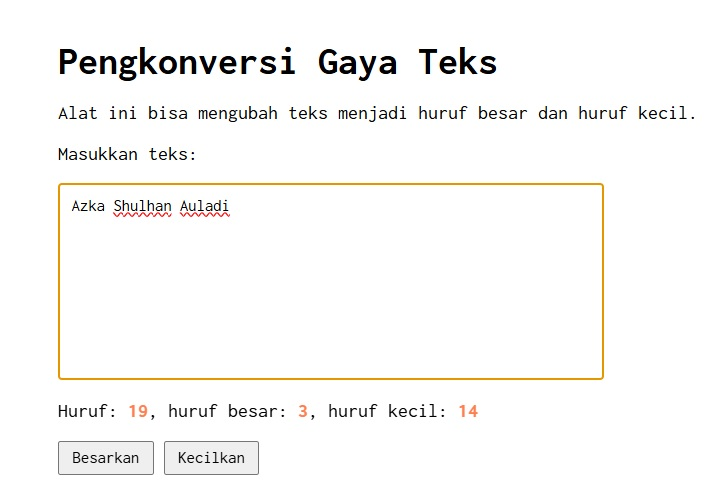

# Tugas Mandiri 03: GUI dengan HTML dan CSS

**Nama:** Azka Shulhan Auladi
**NIM:** 103122400006
**Kelas:** SE-08-01

## Tugas
Setelah kamu menyelesaikan tugas pendahuluan (bisa buka di atas), terapkanlah fungsi untuk (1) menghitung huruf kecil yang disediakan di #hk, (2) mengubah huruf kecil ke huruf besar ketika pengguna menekan tombol #huruf-besar, dan (3) mengubah huruf besar ke huruf kecil ketika pengguna menekan tombol #huruf-kecil.

Kemudian, hapuslah fitur "Paragrafkan" dari alat.

NOTE: Asprak akan mereplikasi hasil tugas teman-teman apakah sesuai dengan harapan DAN apakah output, kode sumber, dan deskripsi sama sesuai.

## Kode Sumber
Tersedia di [index.html](./index.html) [index.css](./index.css) dan [index.js](./index.js)

## Output

## Deskripsi Program

Program ini dapat menghitung jumlah huruf yang diketik secara real-time. Setiap karakter yang dimasukkan akan diperiksa satu per satu. Jika karakter berupa huruf kapital, maka akan dihitung sebagai huruf besar, sedangkan jika berupa huruf kecil akan dihitung sebagai huruf kecil. Keduanya juga akan dijumlahkan untuk mendapatkan total keseluruhan huruf.

Selain itu, program ini menyediakan tombol Besarkan untuk mengubah seluruh teks menjadi huruf kapital dan tombol Kecilkan untuk mengubah seluruh teks menjadi huruf kecil.