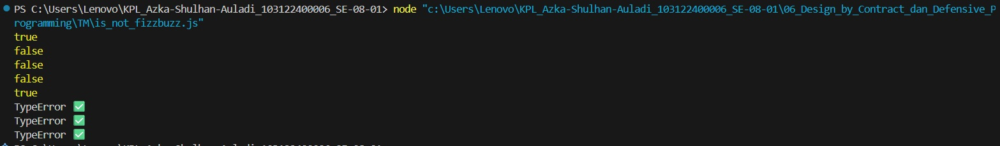

# Tugas Mandiri 06: Design by Contract dan Defensive Programming

**Nama:** Azka Shulhan Auladi
**NIM:** 103122400006
**Kelas:** SE-08-01 

## Tugas
Lindungi kode ini dari bilangan-bilangan "fizz buzz"!

Tugasmu adalah membuat fungsi yang menolak bilangan-bilangan kelipatan 3, 5, atau 15, menerima bilangan-bilangan bukan "fizz buzz", dan melempar yang bukan bilangan bulat.
```
function is_not_fizzbuzz(number) {
  // TODO
}

console.log(is_not_fizzbuzz(1)) // true
console.log(is_not_fizzbuzz(3)) // false
console.log(is_not_fizzbuzz(5)) // false
console.log(is_not_fizzbuzz(30)) // false
console.log(is_not_fizzbuzz(7)) // true
console.log(is_not_fizzbuzz(null)) // Lempar TypeError
console.log(is_not_fizzbuzz(NaN)) // Lempar TypeError
console.log(is_not_fizzbuzz(Infinity)) // Lempar TypeError
```

## Kode Sumber
Tersedia di [is_not_fizzbuzz.js](./is_not_fizzbuzz.js) 

## Output



## Deskripsi Program
Fungsi is_not_fizzbuzz berfungsi untuk mengecek apakah sebuah angka tidak termasuk dalam aturan FizzBuzz. Pertama, fungsi memastikan bahwa input yang diberikan adalah angka yang valid. Jika input berupa nilai yang tidak sesuai seperti null, NaN, Infinity, atau bukan angka sama sekali, maka fungsi akan melempar TypeError. Setelah itu, fungsi memeriksa apakah angka tersebut merupakan kelipatan 15, 3, atau 5. Jika iya, hasilnya false karena angka tersebut termasuk FizzBuzz. Jika tidak, hasilnya true yang berarti angka tersebut bukan FizzBuzz.