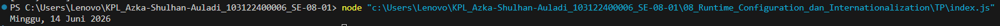

# Tugas Pendahuluan 08: Runtime Configuration dan Internatonalization

**Nama:** Fatikhah Sukma Arti
**NIM:** 103122400019  
**Kelas:** SE-08-01  

## Tugas
Tampilkan tanggal sekarang dengan format seperti ini:
```
Minggu, 14 Juni 2026
```

Nilai waktu tidak harus sama, asalkan formatnya benar dan bisa tampil di komputer terpisah pada waktu tertentu. Gunakan ```Intl.DateTimeFormat``` (bukan string manual).

## Kode Sumber
Tersedia di [index.js](./index.js)

## Output



## Deskripsi Program
Program ini tugasnya nampilin tanggal hari ini dengan format yang rapi dan otomatis. Pertama, program ngambil tanggal dan waktu sekarang dari komputer pakai new Date(). Setelah itu, tanggal tersebut diformat menggunakan Intl.DateTimeFormat dengan locale 'id-ID' supaya nama hari dan bulan muncul dalam bahasa Indonesia.

Di bagian opsi format, program meminta agar yang ditampilkan adalah nama hari lengkap, tanggal, nama bulan lengkap, dan tahun. Setelah selesai diformat, hasilnya langsung dicetak ke terminal menggunakan console.log. Jadi output yang muncul bisa berupa tulisan seperti "Senin, 20 April 2026", dan nilainya akan selalu mengikuti tanggal saat program dijalankan tanpa perlu diubah secara manual.