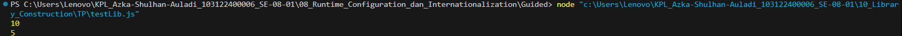

# Tugas Pendahuluan 10: Library Construction

**Nama:** Azka Shulhan Auladi
**NIM:** 103122400006
**Kelas:** SE-08-01  

## Tugas
Buatlah pustaka JavaScript yang menyediakan utilitas berupa dua fungsi yang menghitung jumlah huruf dan jumlah kata.

Kriteria:
1. Hanya alfabet A hingga Z yang dihitung (besar dan kecil)
2. Spasi tidak dihitung
3. Pustaka bisa diimpor

## Kode Sumber
Tersedia di [index.js](./index.js) dan [testLib.js](./testLib.js)

## Output

 

## Deskripsi Program
Pustaka JavaScript ini dibuat sebagai utility kecil buat ngolah teks. Isinya ada dua fungsi utama, yaitu hitungHuruf buat ngitung jumlah huruf dan hitungKata buat ngitung jumlah kata dalam sebuah teks.

Pada fungsi hitungHuruf, perhitungan cuma fokus ke karakter alfabet. Makanya dipakai regex supaya angka, simbol, atau karakter lain yang bukan huruf nggak ikut masuk ke hasil perhitungan.

Sedangkan fungsi hitungKata bekerja dengan memecah kalimat berdasarkan spasi. Setelah itu, hasilnya disaring lagi supaya bagian kosong yang muncul karena spasi berlebih nggak dianggap sebagai kata. Dengan cara ini, jumlah kata yang dihitung tetap akurat meskipun format teksnya tidak selalu rapi.

Karena menggunakan sistem modul dengan export, pustaka ini bisa langsung diimpor ke file lain dan digunakan kembali di berbagai proyek tanpa perlu menyalin kode secara berulang.